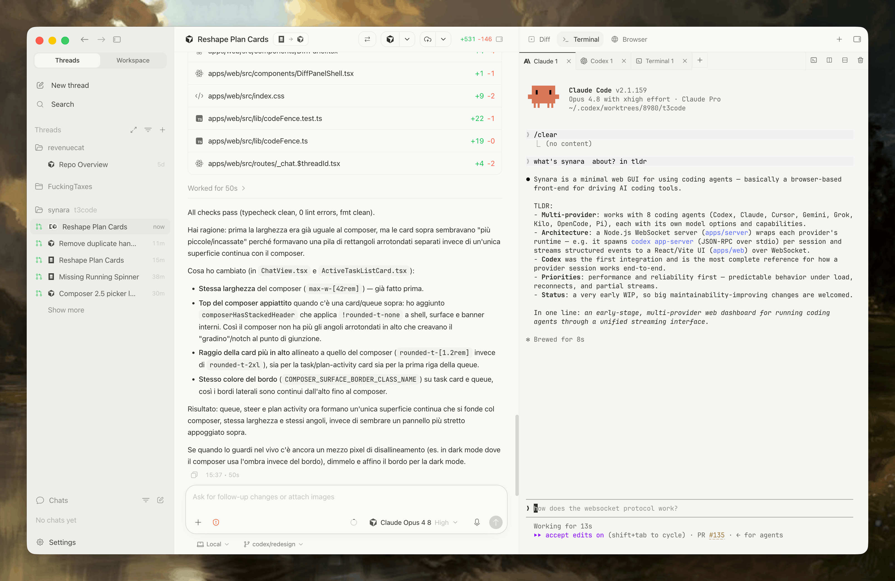
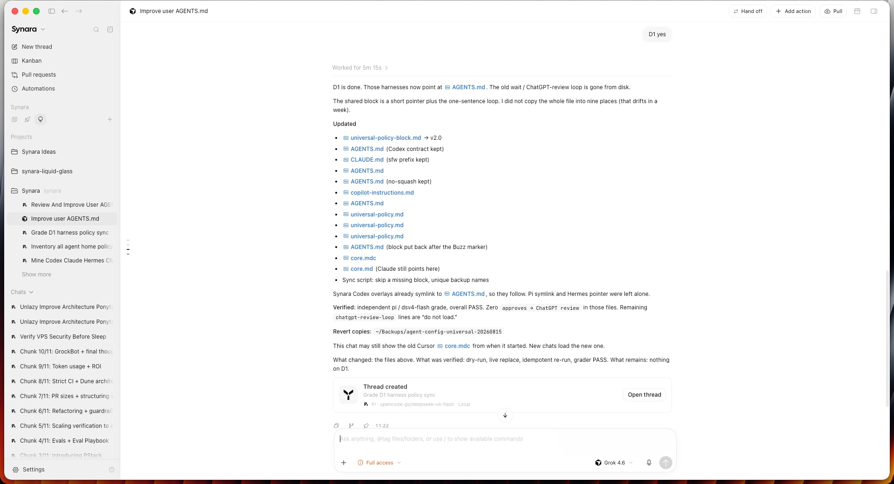

> [!WARNING]
> **Synara Beta is not ready.** This repository is an early development preview: expect breaking changes, incomplete features, and instability. Do not use it for anything important yet.

<div align="center">
  
  <h1>Synara Beta</h1>
  <p><strong>The fast-iteration preview channel for Synara.</strong></p>
  <p>
    A native multi-agent GUI for coding models. Build, test, and orchestrate with Codex, Claude Code, Cursor, Antigravity, and your local AI runtimes.
  </p>
  <p>
    <a href="https://www.trysynara.com/">Website</a>
    &nbsp;·&nbsp;
    <a href="https://www.trysynara.com/docs">Documentation</a>
    &nbsp;·&nbsp;
    <a href="./docs/external-mcp.md">MCP Integration</a>
    &nbsp;·&nbsp;
    <a href="https://github.com/kartikkabadi/synara-beta/releases">Releases</a>
    &nbsp;·&nbsp;
    <a href="https://github.com/kartikkabadi/synara-beta/issues/new">Report an Issue</a>
  </p>
</div>

> [!TIP]
> **Coexistence with Synara Stable**
> Synara Beta is engineered to run seamlessly side-by-side with Synara Stable on the same machine. It uses an isolated data directory (`~/.synara-beta`), separate ports, and a dedicated bundle identifier (`com.emanueledipietro.synara.beta`) to guarantee zero config collisions or session overwrites.

<p align="center">
  <picture>
    <source media="(prefers-color-scheme: dark)" srcset="./assets/prod/readme-hero-dark.png">
    <source media="(prefers-color-scheme: light)" srcset="./assets/prod/readme-hero-light.png">
    
  </picture>
</p>

---

## Overview

Synara Beta is the active preview channel of **Synara** — an open-source, multi-agent desktop GUI designed for developers orchestrating local coding models.

Instead of locking you into proprietary cloud proxies or web chat wrappers, Synara connects directly to the coding agent runtimes already installed and authenticated on your machine. Synara Beta delivers early access to experimental provider runtimes, high-throughput streaming optimizations, and cutting-edge workflow tooling before they graduate to the Stable release.

---

## Core Capabilities

### 1. Multi-Agent Provider Runtime

Synara Beta brings every local agent into a unified, focused workspace. Switch models on the fly, run different agents on different tasks, and harness your existing subscriptions directly.

| Runtime | Integration Mechanism | Key Strengths |
| :--- | :--- | :--- |
| **OpenAI Codex** | Native CLI / `codex app-server` (JSON-RPC over stdio) | High-reasoning agentic turns, structured diff proposals |
| **Anthropic Claude** | Claude Code CLI integration | Rapid tool use, deep refactoring, architectural planning |
| **Cursor** | Cursor Agent Runtime | Deep codebase indexing, inline file edits |
| **Google Antigravity** | Antigravity CLI | Multimodal workflows, tool execution, agent orchestration |
| **xAI Grok** | Grok Build runtime | Accelerated reasoning, rapid iterative development |
| **Factory Droid** | Factory Droid CLI | Autonomous developer workflows and spec enforcement |
| **OpenCode & Pi** | Local & Open-Source LLMs | Self-hosted models via Ollama, vLLM, or custom endpoints |
| **Devin** | Devin CLI integration | Autonomous multi-step software engineering workflows |

---

### 2. Unified Workspace & Thread Orchestration

Keep the active conversation directly alongside the surfaces it modifies. Projects define the workspace context, while threads preserve task-specific history, environment state, and live execution diffs.

<p align="center">
  <picture>
    <source media="(prefers-color-scheme: dark)" srcset="./assets/prod/readme-split-view-dark.png">
    <source media="(prefers-color-scheme: light)" srcset="./assets/prod/readme-workspace-light.png">
    
  </picture>
</p>

- **Project-Aware Context:** Seamlessly navigate between repositories and track related tasks without mixing uncommitted files.
- **Provider & Model Selection:** Choose the ideal model (Codex, Claude, Cursor, Antigravity, Grok) per task based on complexity and speed.
- **Persistent Goals:** Attach explicit multi-turn objectives with pause/resume, achievement history, and bounded autonomous continuation.

---

### 3. Dual-Thread Split Views & Live Previews

Compare model responses, run parallel investigations, or tackle front-end and back-end tasks simultaneously. Synara’s split-view system lets you pin and control two active agent threads side-by-side with independent context, tokens, and controls.

- **Side-by-Side Comparison:** Evaluate how different models approach the same architectural challenge.
- **Dual Working Panes:** Inspect diffs in one pane while interacting with an agent prompt in the other.
- **Mobile & Device Simulators:** Place live iOS Simulator or Android device previews directly beside running agent threads.

---

### 4. Integrated Browser & WebMCP Execution

Never context-switch to test web apps. Synara embeds a full Chromium-based browser right next to your agent thread.

- **Live Local Previews:** Preview `http://localhost:3000` or local dev servers with automatic hot-reload.
- **WebMCP Tooling:** Agents can inspect the DOM, interact with buttons and forms, take screenshots, and invoke semantic or page-declared WebMCP actions.
- **Visual Feedback Loop:** Agents verify their own UI changes before marking tasks complete.

---

### 5. Seamless Cross-Agent Handoffs

Stuck on a tricky bug or want a second opinion? Pass active work between models with a single click.

Synara's handoff engine carries over conversation history, active project context, and uncommitted diffs to the target agent runtime without manual copying or re-prompting. Start an architectural plan with Claude, execute heavy edits with Codex, and review with Cursor.

---

### 6. Isolated Git Worktrees & Branch Management

Avoid dirty working trees and merge conflicts when running multiple concurrent tasks.

- **Managed Worktrees:** Spin up isolated, throwaway Git worktrees per thread so parallel agents can edit the same repository without colliding.
- **Full Review Surface:** Review diffs, stage files, discard hunks, and commit changes directly from the UI.
- **One-Click GitHub Integration:** Branch, push, and open pull requests right from your thread.

---

### 7. Appearance & Workspace Preferences

Tailor the environment to your setup and aesthetic preferences.

- **Themes:** Dark, Light, Synara, and Codex presets with high-contrast accessibility toggles.
- **Typography:** Custom UI and monospace coding fonts (e.g. JetBrains Mono, Inter, Fira Code).
- **Layout Ergonomics:** Adjustable density modes, translucent glass sidebars, and customizable keybindings.

---

## Workspace Architecture

Synara organizes your workflows into clear, modular layers:

| Layer | Purpose |
| :--- | :--- |
| **Project** | Repository context, configuration, and workspace-level settings. |
| **Thread** | Task-specific conversation, ephemeral state, files, and transcript history. |
| **Provider Session** | The local, authenticated coding-agent process executing the instructions. |
| **Execution Surfaces** | Diff review, embedded terminal, Chromium browser, file tree, and Git tools. |

---

## Installation

### Desktop Application

Pre-built binaries for Synara Beta will be published on [trysynara.com](https://www.trysynara.com/) and on the [GitHub Releases](https://github.com/kartikkabadi/synara-beta/releases) page.

Supported native platforms:
- **macOS:** Apple Silicon (`arm64`) & Intel (`x64`)
- **Windows:** x64
- **Linux:** x64 (`.AppImage`, `.deb`)

### Running from Source

You can build and run Synara Beta locally using [Bun](https://bun.sh/) and [Node.js](https://nodejs.org/).

#### Prerequisites
- [Bun](https://bun.sh/) (v1.3.12 or newer)
- [Node.js](https://nodejs.org/) (v24.13.1 or newer recommended)
- [Git](https://git-scm.com/)

```bash
# 1. Clone the repository
git clone https://github.com/kartikkabadi/synara-beta.git
cd synara-beta

# 2. Install workspace dependencies
bun install

# 3. Start the local development server (Web + Server)
bun run dev
```

To launch the native desktop shell during development:
```bash
bun run dev:desktop
```

---

## Repository Structure

```text
synara-beta/
├── apps/
│   ├── desktop/          # Electron desktop application & native OS bridges
│   ├── server/           # Node.js WebSocket backend managing agent stdio runtimes
│   └── web/              # React 19 + Vite web interface and transcript streamer
├── packages/
│   ├── contracts/        # Shared Effect/Schema contracts and WebSocket protocol types
│   └── shared/           # Cross-package runtime utilities, git helpers, and diff logic
├── docs/                 # In-depth architectural guides and protocol specs
└── assets/               # Branding assets, vector icons, and screenshots
```

---

## External MCP Integration

Synara Beta includes a built-in Model Context Protocol (MCP) server, allowing external agent clients (such as Claude Desktop, Cursor, or external scripts) to securely interact with your active Synara projects, threads, and workspace tools.

For setup instructions and permission scopes, see [External MCP Documentation](./docs/external-mcp.md).

---

## Contributing & Community

Contributions, bug reports, and suggestions are warmly welcomed!

- **Found a bug?** [Open an issue](https://github.com/kartikkabadi/synara-beta/issues/new) with the Synara Beta version, operating system, agent runtime, and reproduction steps.
- **Want to contribute?** Feel free to submit a pull request against `main`. Please ensure code formatting and type checks pass.
- **Stay updated:** Follow developments at [trysynara.com](https://www.trysynara.com/).

---

## License

Synara Beta is open-source software licensed under the [MIT License](./LICENSE).
